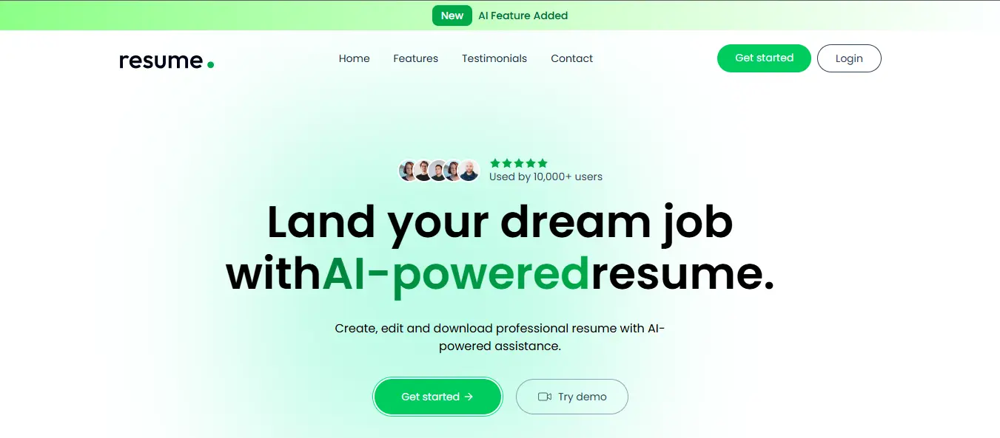

<div align="center">
   <h3 align="center">Resume Builder - with AI enhance</h3>
  <br />
    <a href="https://resume-builder-fp.vercel.app/" target="_blank">
      
    </a>
  <br />

  <div>
    
    
   
    <br/>
   
   
    
   
  </div>   
  <a href="https://resume-builder-fp.vercel.app/" target="_blank">
      
    </a>
</div>

## 📋 <a name="table">Table of Contents</a>

1. ✨ [Introduction](#introduction)
2. 🛠 [Tech Stack](#tech-stack)
3. 🚀 [Features](#features)
4. 🤸 [Quick Start](#quick-start)

 


## <a name="introduction">✨ Introduction</a>

A professional Resume Builder with live preview and PDF generation. Built with a focus on clean UI and efficient state management for a smooth user experience.


## <a name="tech-stack">🛠 Tech Stack</a>

- **[Vite](https://vite.dev)** is a next-generation frontend tool that provides an extremely fast development experience. It leverages native browser ES modules and a highly optimized build process to ensure instantaneous Hot Module Replacement (HMR) and superior performance.

- **[React](https://react.dev)** is a declarative, efficient, and flexible JavaScript library for building component-based user interfaces. It enables developers to create complex, high-performance web applications with a seamless developer experience and a robust ecosystem.

- **[TailwindCSS](https://tailwindcss.com/)** is a utility-first CSS framework that allows developers to build custom, responsive designs quickly without leaving their HTML. It provides pre-defined classes for layout, typography, colors, and more.

- **[JavaScript](https://developer.mozilla.org/en-US/docs/Web/JavaScript)** s a high-level, interpreted programming language that serves as the scripting language for the Web. It is the core technology that enables interactive content, dynamic updates, and complex features on almost every modern website.

- **[MongoDB](https://www.mongodb.com/)** is a flexible, high-performance NoSQL database. It stores data in JSON-like documents, supports dynamic schemas, and provides robust features for scalability, replication, and querying.
  
- **[Node.js](https://nodejs.org/en)** is a powerful, open-source JavaScript runtime built on Chrome's V8 engine. It uses an event-driven, non-blocking I/O model that makes it lightweight and efficient, perfect for building fast, scalable network applications and real-time APIs.
- **[JWT](https://www.jwt.io/)** is a compact, URL-safe standard for securely transmitting information between parties as a JSON object. It is widely used for stateless authentication, allowing servers to verify user identity and permissions without the need to store session data on the server side.


## <a name="features">🚀 Features</a>

👉 **User Authentication**:Secure Sign-up and Login system for personal data protection.

 👉 **Full CRUD Functionality**:
 - **Create**: Generate multiple resumes tailored for different job roles.
 - **Read**: View and manage all saved resumes within a dedicated user dashboard.
 - **Update**: Edit and refine previously saved resumes at any time.
 - **Delete**: Easily remove outdated or unwanted resumes from your profile.
     
👉 **Resume Uploading**:Import existing files to streamline the editing process.

👉 **Real-time Preview**:Instantly visualize changes as you edit your information.

👉 **Export to PDF**:High-quality PDF generation, ready for job applications.

👉 **Responsive Design**: A fully optimized UI for mobile, tablet, and desktop views using Tailwind CSS.


## <a name="quick-start">🤸 Quick Start</a>

Follow these steps to set up the project locally on your machine.

**Prerequisites**

Make sure you have the following installed on your machine:

- [Git](https://git-scm.com/)
- [Node.js](https://nodejs.org/en)
- [npm](https://www.npmjs.com/) (Node Package Manager)

1. **Cloning the Repository**

```bash
git clone https://github.com/rezaHosseini98/resume-builder.git
cd resume-builder
```
2. **Backend Setup (Server)**

 The backend uses Node.js with Nodemon for development.

 Navigate to the server directory:
 
 ```bash
cd server
```
**Installation**

Install the project dependencies using npm:

```bash
npm install
```

**Set Up Environment Variables**

Create a new file named `.env` in the server folder of your project and add the following content:

```env
#MongoDB
MONGODB_URL=
#JWT 
JWT_SECRET=
#Imagekit key
IMAGEKIT_PRIVTE_KEY=
#Gemini key
OPENAI_API_KEY=

OPENAI_BASE_URL="https://generativelanguage.googleapis.com/v1beta/openai/"

OPENAI_MODEL="gemini-2.5-flash"
```

Replace the placeholder values with your real credentials. You can get these by signing up at: [MongoDB](https://www.mongodb.com/),[ImageKit](https://imagekit.io/),[Gemini](https://aistudio.google.com/).

**Running the Project**

```bash
npm run server

```
Open [http://localhost:3000](http://localhost:3000) in your browser to view the project.(see the message : Server is live...)

3. **Frontend Setup (Client)**

The frontend is powered by Vite.

Open a new terminal and navigate to the client directory:

```bash
cd client

```
**Installation**

Install the project dependencies using npm:

```bash
npm install
```

**Set Up Environment Variables**

Create a new file named `.env` in the client folder of your project and add the following content:
```env
VITE_BASE_URL="http://localhost:3000"
```
**Running the Project**

```bash
npm run dev

```

Open [http://localhost:5173](http://localhost:5173) in your browser to view the project.

**Project Structure**
```bash
resume-builder/
├── client/          # Frontend
│   └── .env        
└── server/          # Backend 
    └── .env       
```

 
